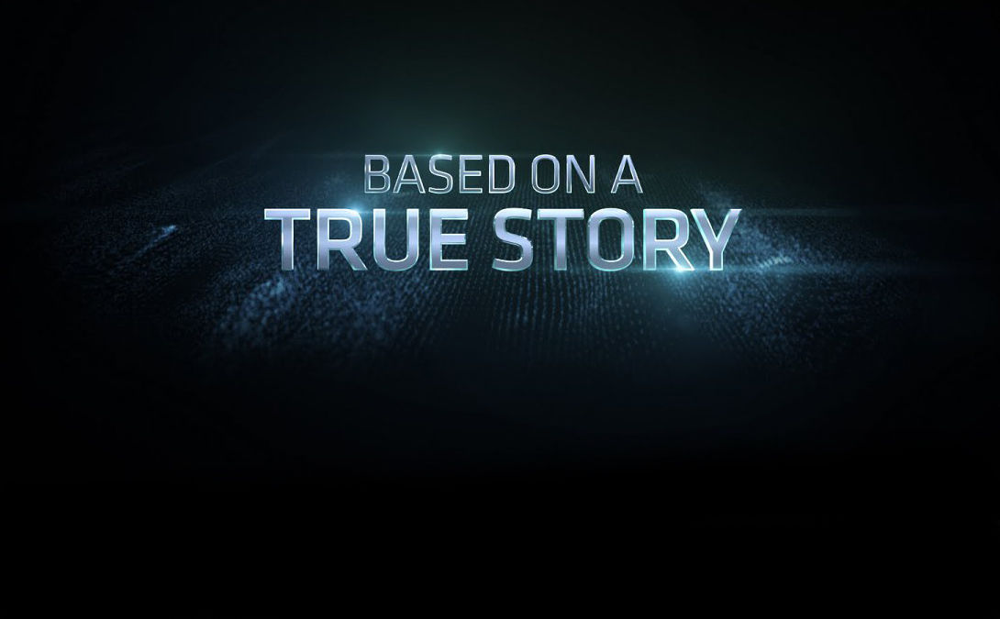
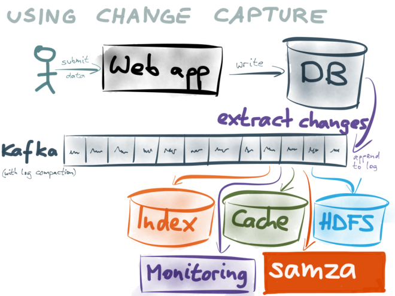

# We're already doing microservices!

---

# Contents

- InstaMike Pains :tired_face:...
- Bounded Contexts :bento:
- What are these Micro things :space_invader:?
- :space_invader: Gotchas :stuck_out_tongue:
- Must Win.

---

## Detailed Contents(REMOVE THIS SLIDE)

- Mike Pains 😫...
- Pains: Gem updates
- Pains: Scaling
- Pains: Deploying
- Bounded Contexts
  - Devise Context -> Auth-er ('Cookie' Service)
  - Image Context -> Image-er 👾 (HTTP Service)
  - Bottl-er (Postgres side ETLs)

---

## Detailed Contents(REMOVE THIS SLIDE)

- Introducing Microservices 👾
- Microservices Flavors
- Workers to Work-er-s 🤓

- Caveats
- Must Win

---

#[fit] InstaMike 📷👨


^ This is the story of InstaMike, a web application that using some
special techniques, was able to scale from 10 users to millions of them
without having to rewrite their application.

---


### MustWin :hearts: :space_invader:

^ Though InstaMike doesn't exist, this talk is based on a couple true stories.

---
# What's a Rails monolith?


* An app that's so big and complex that it's slowing down your team
* It's a single point of failure
* It's complexity makes simple tasks painful

^ There isn't a formal definition for a Rails monolith, but a good
definition is an app that is slowing down your team. It's also a single
point of failure, and has a couple issues that cause pain to your team.

---

## :tired_face: Gem updates were painful

^For InstaMike, one of those things that became more and more painful as
the app grew was updating gems.

---

## :tired_face: Gem updates were painful

^Even though the great engineers at InstaMike were careful and tagged
their gemfile with specific versions, they frequently had to fork or
vendor gems to get around incompatible versions. They even had to update
old gems themselves to keep them running.

```tex
Bundler could not find compatible versions for gem "tilt":
  In Gemfile:
    sass-rails (= 3.2.6) ruby depends on
      tilt (~> 1.3) ruby

    slim (>= 0) ruby depends on
      tilt (2.0.0)
```
---
##  :tired_face: :money_with_wings: moar instances/dynos less money!


---
##  :tired_face: :money_with_wings: moar instances for just one endpoint


* InstaMike had a user/images route in their app. It accounted for
  98% of it's traffic.
* They kept having to buy more boxes just for this one endpoint.
* It was 💰💰💸

^Because of a bad/dated decisions, InstaMike's javascript called
updates.json multiple times each page load. Because it's a monolith, you
cannot scale "just one route" so if you need extra capacity, you need to
install the full app to a new box, which is a waste of resources.

---

## The engineers missed Saturdays :tired_face: :tired_face:


---

## Saturday was the only "safe day" to deploy :tired_face: :tired_face:

* If everything lives inside one app, then the whole team needs to be in sync
  while doing releases.
* For InstaMike that meant that all releases had to happen on Saturday
  Morning when the users were less active.
* It was :tired_face:

^Bigger apps create bigger risks, again upgrading a small gem can have drastic
consequences if all scenarios haven't been tested out. So for the poor
InstaMike team, that meant that all engineers had to be on-call for each
deploy, just in case something weird broke. It wasn't great.

---

# How did they fix InstaMike? :bento: Divide and conquer!


1. Identify what things belong together
2. Isolate the parts
3. Scale those parts

^This was the strategy InstaMike's engineers used for fixing their
pains. They identified what things belonged together, then they isolated
them and finally they figured out a way of scaling them by extracting
them out of the monolith.

---
# Bounded Contexts FTW! :bento:


### "A specific responsibility enforced by explicit boundaries"

A small set of of models that operate almost independently of the rest of the
app.

^Eric Evans defines bounded contexts as "a specific responsibility
enforced by explicit boundaries". In other words a set of related models
that can work independently from the rest.

---

# Bounded Contexts FTW! :bento:

```ruby
$ tree libs/
libs/
├── analytics
│   ├── ab_groups.rb
│   └── generate_report.rb
├── photos
│   ├── filters.rb
│   ├── resize.rb
│   └── upload.rb
└── user
    ├── friends.rb
    └── user.rb
```

^ In the case of InstaMike, we were lucky enough that there was a very well organized libs folder (which is the Sock drawer of most rails app). This structure very clearly shows the contexts they had to work with.

---
# Bounded Contexts FTW! :bento:

* Rails Engines are bounded contexts

```ruby
module Blorgh
  class Engine < ::Rails::Engine
  end
end
```
^ Another easy way to spot :bentos: bounded context is to look for rails engines (like devise)

---

## :bento: -> :space_invader:
## Devise Context -> Auth-er

* Devise is the most used authentication gem in rails
* It's an engine that allows your users to be logged in or out

---

## :bento: -> :space_invader:
## Devise Context -> Auth-er

* In a nutshell what does devise do? Setup a warden cookie
* That's it
* Your app is responsible for what to do with the "logged user"

```ruby
  def sign_in(resource_or_scope, *args)
    options  = args.extract_options!
    [...]

    expire_data_after_sign_in!

    [...]
    warden.session_serializer.store(resource, scope)
  end
```
^ So if we look at devise it's single task is to setup a cookie.

---

## :bento: -> :space_invader:
## Devise Context -> Auth-er

* Could you set that cookie on one Rails app and use it in another?
* YES!

The Auth-er app is now a simple devise app with just these three gems

```ruby
source 'https://rubygems.org'

gem 'rails', '4.1.2'
gem 'devise', '3.2.1'
gem 'omniauth', '1.0.2'

```

^After realizing that, the InstaMike team created a separate app that
has one simple goal: login the user and redirect it to the main
application. This allowed it's team to work independently on the signup
flow without having to touch the main app.

---

## :bento: -> :space_invader:
## Devise Context -> Auth-er

* And you can even use these sessions outside of rails
* https://github.com/mattetti/goRailsYourself

```ruby
railsSecret := "f7b5763636f4c1f3ff4bd444eacccca295d87b990cc104124017ad70550edcfd22b8e89465338254e0b608592a9aac29025440bfd9ce53579835ba06a86f85f9"
encryptedCookieSalt := []byte("encrypted cookie")
encryptedSignedCookieSalt := []byte("signed encrypted cookie")

kg := KeyGenerator{Secret: railsSecret}
secret := kg.CacheGenerate(encryptedCookieSalt, 32)
signSecret := kg.CacheGenerate(encryptedSignedCookieSalt, 64)
e := MessageEncryptor{Key: secret, SignKey: signSecret}
```
^And after that the InstaMike team realized that if they can decode the
session, then they can use that on apps written on other languages. For
example go. This was a first solid step for splitting apart the
monolith.

---

## :bento: -> :space_invader:
# The Image Context

On many social apps Images need to be:
* Resized
* Scaled
* Cached
* Uploaded

^Images are a very clear bounded context that is usually required for
social apps. But does the main app need to do all this work?
No!

---

## :bento: -> :space_invader: Imag-er

Can be implemented with just 3 lines:

```ruby
$ gem install magickly
$ gem install thin
$ thin start

```

^After noticing this very clear pattern, InstaMike's team did some
research and found Magickly. A gem that creates an app to resize images
on the fly.

---

## http://imager.instamike.com/magic.png?saturation=150


^ Using this app is very simple, you just do an http request to it,
using parameters to specify what operation to do

---

## http://imager.instamike.com/magic.png?flip=true


^Like flipping vertically

---

## http://imager.instamike.com/magic.png&flop=true


^Or horizontally

---


## :bento: -> :space_invader: Image-er
# Try it!
* http://bit.ly/1nsp3vI
* http://magickly.afeld.me/?src=http://i.imgur.com/fj5D8Nq.gif&flip=true

* http://magickly.afeld.me/?src=http://i.imgur.com/fj5D8Nq.gif&two_color=true

^You guys can even try it online if you like!

---

## :bento: -> :space_invader:
# ETL context -> Bottle-er

* Postgres has a log of events
* Every time you do an operation it gets updated
* It is used to replicate the database
* So, instead of running a ruby script to generate reports every night,
  could we just hook into it?
* YES.


^ InstaMike engineers got really excited with these contexts. So they
started thinking outside the box and came with a good hack to extract
reports.

^Postgres internally has a Write Ahead Log, which is a stream of events
that is used for replication.

^ What if we used that to extract data an push it into a report
generation pipeline?

---

## :bento: -> :space_invader: Bottle-er



^ That's what bottler does. It pushes postgres events into a kafka
database. Then it creates the reports they want in almost real time. It
uses the bottled water app internally.

---

## :bento: -> :space_invader: Bottle-er

Integration is really simple:
```ruby
$ docker run -d --name bottledwater --hostname bottledwater
\ --link postgres:postgres
\ --link kafka:kafka
\ --link schema-registry:schema-registry
confluent/bottledwater:0.1
```

^ You just point this app to the postgres and kafka database, and done.
All events get replicated

---

# So what are these things?

# :space_invader:

^ So what are these auth-er, imag-er & -bottl-er things?

---


## These :space_invader: things are Microservices!

### Helper services (apps) you can rewrite from scratch in 2 weeks or less.
^Let's give these things a name, they are microservices. A
microservice is a helper application you can rewrite from scratch in 2
weeks or less. I really like this definition because it doesn't force a technology,
concurrency model or communication channel

---
## These :space_invader: things are Microservices!


* Auth Sharing services
* Http Services
* Database sharing services
* Messaging Queue services

^We just went over a couple different styles of Microservices, one that
shared the authentication, another one that talked via http, and there
are others.

---


##  Microservices :space_invader: can:

* Be written in any language
* Talk other services via Rest, Redis, RabbitMQ, Cookies, or
  smoke signals
* Live inside or outside your app's firewall
* Can scale individually

^So here's a list of important facts about them.
^They can be written in
any language. They can talk to other services via multiple methods and
they live inside or outside your app's firewall. They can also be scaled
individually.

---
## If your app uses Resque, you're already using services (but not microservices)

## To get them to be :space_invader::

- Make them smaller. Their dependencies must also be able to be
  rewriten in 2 weeks.- Enable them to scale individually (Some implementations already
  allow you to do this).
- Stop them loading the whole app inside them

^Workers are awesome and you probably are already using them. They are services in disguise. Really! They
are apps that work outside the main web app and talk to each other via
Redis, RabbitMQ or some other Pub-Sub Channel. And live outside the main
webapp. Though, they are still not micro-services, to get there they
need to be smaller with few dependencies, can scale individually and
don't load the whole Rails app.

---
# :space_invader: Microservices aren't perfect

There are many gotchas for getting Microservices right:

* Distributed systems are hard. (Pick speed, consistency or availability)
* Debugging across multiple services can be tricky
* Creating development & production environments becomes harder
* Beware of Microservice envy. Use them where they are needed.

---

# Three quick tips before wrapping up:

* RabbitMQ or any other messaging service makes it easier to keep state
  consistent. HTTP loses messages very easily.
* Try to minimize state as much as you can. Replication is very costly
* Check the references (Specially Sam Newman's book)

---

# Must Win builds :heart: apps
I'm Gonzalo Maldonado and I'm a lead engineer at Must Win.
We build :heart: apps. (Sometimes with :space_invader: Microservices)

Check us out at
# MustWin.com

---

### References
* Sam Newman's Building Microservices
* High Scalability blog
* Continuous Deployment
* Ruby Rogues
* https://speakerdeck.com/elg0nz/5-ways-we-screwed-up-microservices
* Eric Evan's Domain Driven Design
* CODE GENIUS - Magickly, Mustachio, & Stateless APIs by Aidan Feldman
* https://github.com/confluentinc/bottledwater-pg

`footer: mustwin.com
---

### Image Credits
* https://flic.kr/p/ymPxN
* https://flic.kr/p/62rNAB
* https://flic.kr/p/t1um7

`footer: mustwin.com
---
# Slides
* https://github.com/elg0nz/microservices-talk

`footer: mustwin.com
